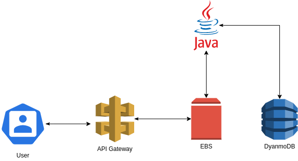

# Triangle Classification

Triangle Classification is a cloud API used to classify a triangle by their sizes.

## Run

To run locally
```bash
mvn clean install
```
To run testes
```bash
mvn test
```
To do requests on cloud
```link
http://triangleclassifier-env.eba-eay3gaz3.us-east-1.elasticbeanstalk.com
```

## Architecture
The service was built in Java with Spring Boot. The application is stored in EBS on AWS. The EBS allows integration with API gateway, which is the entry point for the available requests. All, even requests, even results are stored in AWS. They are all available to query.




## Endpoints
This API has two endpoints. All the endpoints contains a Basic Authentication. It should be sent in the header. For test purposes, you can use _username_: Lais, *password*: 1234.

- *POST* - Used to create a new classification.\
  Example of request:
```json
{
    "sizeOne": 3,
    "sizeTwo": 2,
    "sizeThree": 1
}
```
Example of response:
```json
{
    "type": "SCALENE"
}
```
- *GET* - Used to get all requests and results stored in Dynamo made using the POST endpoint.\
  Example of Response:
```json
[
    {
        "index": "29692a89-070a-426e-a17c-cc8a2139f78d",
        "request": "TriangleRequest(sizeOne=2, sizeTwo=2, sizeThree=2)",
        "result": "EQUILATERAL"
    },
    {
        "index": "84aca5d0-0044-4b35-8dc0-10e349a80865",
        "request": "TriangleRequest(sizeOne=2, sizeTwo=2, sizeThree=1)",
        "result": "ISOSCELES"
    },
    {
        "index": "03fd7676-0cfb-42b1-987c-ae0dfd95bba9",
        "request": "TriangleRequest(sizeOne=1, sizeTwo=1, sizeThree=1)",
        "result": "EQUILATERAL"
    }
]
```
Also, you can get the endpoints mapper on [Swagger](http://triangleclassifier-env.eba-eay3gaz3.us-east-1.elasticbeanstalk.com/swagger-ui.html). Don't forget to send the test credentials.

---

Pull requests are welcome. For major changes, please open an issue first to discuss what you would like to change.

Please make sure to update tests as appropriate.

## License
[MIT](https://choosealicense.com/licenses/mit/)